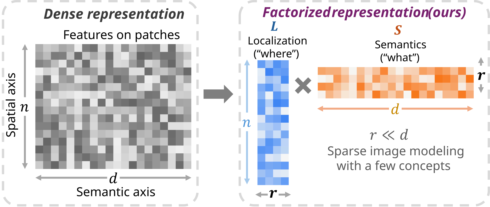
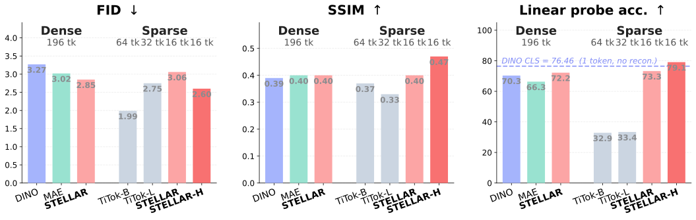

# STELLAR: Learning Sparse Visual Representations via Spatial–Semantic Factorization

[](https://arxiv.org/abs/2602.01905)
[](https://icml.cc/)
[](LICENSE)
[](#citation)

> **STELLAR** learns a **unified sparse visual representation** that supports both **reconstruction** (2.60 FID) and **semantics** (79.10% linear-probing accuracy) — using only **16 tokens**, a **90% reduction** in latent size compared to a dense grid.

<p align="center">
  
</p>

By factorizing **"what"** (semantics) from **"where"** (spatial layout), STELLAR represents each image as the low-rank product of a **localization** matrix and a **semantics** matrix — modeling the multiple concepts in an image together with where they appear, for an efficient and holistic vision representation.

<p align="center">
  
</p>

---

## Highlights

- **Sparse & unified** — one set of 16 tokens serves both high-level semantics and pixel-level reconstruction.
- **Factorized latents** — disentangles semantic content from spatial location, so each token captures a concept and *where* it appears.
- **Strong on both axes** — competitive FID/LPIPS for reconstruction *and* DINO-level linear probing / kNN for semantics.
- **Easy to train** — single config, runs from scratch on ImageNet-1K or any custom image folder.

### Unified representation

A lightweight 6-layer ViT decoder trained on **frozen** STELLAR features handles reconstruction, while linear probing / kNN measure semantic quality (`*` TiTok uses its own larger decoder).

| | | Reconstruction | | Semantics | |
| :--- | :--- | :--- | :--- | :--- | :--- |
| **Model** | **# tokens** | **FID ↓** | **LPIPS ↓** | **Lin.** | **kNN** |
| DINO | 1 | - | - | 76.46 | 74.69 |
| DINO | 196 | 3.27 | 0.2121 | 70.31 | 54.41 |
| MAE | 196 | 3.02 | **0.2071** | 66.32 | 25.82 |
| TiTok* | 32 | 2.75 | 0.3281 | 33.42 | 7.30 |
| TiTok* | 64 | 1.99 | 0.2571 | 32.87 | 7.29 |
| **STELLAR** | **16** | **3.06** | **0.2077** | **73.26** | **67.25** |
| **STELLAR** | **196** | **2.85** | **0.2085** | **72.21** | **64.71** |
| **STELLAR (H)** | **16** | **2.60** | **0.1729** | **79.10** | **77.31** |

<p align="center">
  
</p>

---

## Method

STELLAR encodes an image into a small set of **latent queries** that become
**sparse tokens**. Each token is factorized into a **localization** matrix `L`
(*where* a concept appears, `n × r`) and a **semantics** matrix `S` (*what* the
concept is, `r × d`). Their low-rank product reassembles a dense feature map that
a lightweight decoder reconstructs, while the sparse tokens themselves carry the
semantics.

<p align="center">
  
</p>

Training combines a **reconstruction** loss with self-supervised **clustering**
and **set-alignment** losses: online clustering assigns tokens to prototypes,
and optimal-transport matching aligns the tokens of a global view with those of
partial/augmented views. As a result the factorized tokens localize cleanly to
the semantic regions of an image.

<p align="center">
  
</p>

---

## Installation

```sh
git clone https://github.com/microsoft/STELLAR.git
cd STELLAR

conda create -n stellar python=3.10.14
conda activate stellar

python -m pip install -U "pip<24.1"
pip install -r requirements.txt
```

### External directory

Create one external directory to hold datasets and pretrained weights. We refer to it as `EXTERNAL` throughout:

```text
<EXTERNAL>/
├── ImageData/
│   └── ImageNet/                # ImageNet-1K (see Data preparation)
└── PretrainedModels/
    ├── vqgan/maskgit/           # MaskGIT-VQGAN tokenizer (for reconstruction)
    └── stellar/                 # STELLAR checkpoints (.ckpt)
```

You can point the code at it on the command line with `mounts.external=<EXTERNAL>`.

---

## Pretrained models

| Model | Backbone | # tokens | Type | Download |
| :--- | :--- | :---: | :--- | :--- |
| STELLAR-B16 | ViT-B/16 | 16 | main | [🤗 stellar-b16](https://huggingface.co/microsoft/STELLAR/blob/main/stellar-b16.safetensors) |
| STELLAR-L16 | ViT-L/16 | 16 | main | [🤗 stellar-l16](https://huggingface.co/microsoft/STELLAR/blob/main/stellar-l16.safetensors) |
| STELLAR-H16 | ViT-H/14 | 16 | main | [🤗 stellar-h16](https://huggingface.co/microsoft/STELLAR/blob/main/stellar-h16.safetensors) |
| STELLAR-B8 | ViT-B/16 | 8 | ablation | [🤗 stellar-b8](https://huggingface.co/microsoft/STELLAR/blob/main/stellar-b8.safetensors) |
| STELLAR-B24 | ViT-B/16 | 24 | ablation | [🤗 stellar-b24](https://huggingface.co/microsoft/STELLAR/blob/main/stellar-b24.safetensors) |

All weights are pretrained self-supervised on ImageNet-1K and hosted on the
[🤗 Hugging Face repo](https://huggingface.co/microsoft/STELLAR) as `safetensors`.

We also use the MaskGIT-VQGAN tokenizer from [TiTok](https://github.com/bytedance/1d-tokenizer/blob/main/README_TiTok.md) for image reconstruction. Download [`maskgit-vqgan-imagenet-f16-256.bin`](https://huggingface.co/fun-research/TiTok/blob/main/maskgit-vqgan-imagenet-f16-256.bin) and place it under `<EXTERNAL>/PretrainedModels/vqgan/maskgit/`.

---

## Quick start: extract features

STELLAR produces a small set of sparse tokens per image. For feature extraction you only need the encoder — no decoder or VQGAN tokenizer required.

```python
import torch
from huggingface_hub import hf_hub_download
from safetensors.torch import load_file
from src.models.stellar_model import STELLARModel

# Download the feature-extraction weights from the Hub.
weights = hf_hub_download("microsoft/STELLAR", "stellar-b16.safetensors")

# Build an encoder-only model and load the weights (non-strict: unused heads are skipped).
model = STELLARModel(
    num_sparse_tokens=16,
    vit_pretrained="facebook/vit-mae-base",
    do_recon=False,
    do_clustering=False,
    vq_model=None,
)
model.load_state_dict(load_file(weights), strict=False)
model.eval()

image = torch.rand(1, 3, 224, 224)          # values in [0, 1]
with torch.no_grad():
    out = model.encode(image)

out["sparse"]    # (1, 16, 768)  factorized concept tokens  ("what")
out["spatial"]   # (1, 196, 16)  per-token spatial maps     ("where")
out["cls"]       # (1, 1, 768)   global image token
out["dense"]     # (1, 196, 768) dense patch features
```

| Key | Shape | Use |
| :--- | :--- | :--- |
| `sparse` | `(B, K, D)` | semantic concept tokens (classification, retrieval) |
| `spatial` | `(B, P, K)` | spatial distribution of each token (segmentation, visualization) |
| `cls` | `(B, 1, D)` | global representation |
| `dense` | `(B, P, D)` | dense per-patch features |
| `lowrank` | `(B, P, D)` | reassembled dense map (reconstruction input) |

> The released checkpoints include the decoder and clustering heads too. For image
> reconstruction, `model.reconstruct(features)` is the decoder half of STELLAR — pass the
> factorized features from `model.encode(image)` (or `model.reconstruct(sparse, spatial)`)
> and it runs low-rank dense map → ViT decoder → VQGAN decoder, returning
> `out["reconstruction"]` as `(B, 3, H, W)` RGB pixels in `[0, 1]` (build with
> `do_recon=True` and `vq_model=<maskgit-vqgan path>`). For continued pretraining build the
> full model and train via `model(batch)`. See the
> [model card](https://huggingface.co/microsoft/STELLAR) for the
> `load_stellar(..., purpose=...)` helper and an end-to-end reconstruction demo.

---

## Data preparation

### ImageNet-1K

Download [ImageNet-1K](https://www.kaggle.com/competitions/imagenet-object-localization-challenge/data) and place it under `<EXTERNAL>/ImageData/ImageNet` so that it contains:

```text
ImageNet/
├── ILSVRC/Data/CLS-LOC/train/...
├── ILSVRC/Data/CLS-LOC/val/...
├── imagenet_class_index.json
└── ILSVRC2012_val_labels.json
```

### Custom dataset

STELLAR is fully self-supervised — it needs only images. To train on your own data, point the dataset at a folder of images. The simplest path is to reuse the ImageNet layout (one subfolder per "class"; labels are ignored during pretraining), or implement a small `Dataset` in [src/datasets/](src/datasets/) that returns the same dictionary keys:

```python
{
    "image":        global_views[0],   # (3, H, W)    one global crop
    "global_views": global_views,      # (V, 3, H, W) several global crops
    "local_views":  local_views,       # (V, 3, h, w) several local crops
    "labels":       global_views[0],   # unused by SSL; any tensor works
}
```

See [src/datasets/imagenet_dataset.py](src/datasets/imagenet_dataset.py) for a reference implementation of the multi-crop augmentation.

---

## Pretraining

Training is driven by [Hydra](https://hydra.cc/) configs under [configs/](configs/) and launched through the Olympus trainer:

```bash
python -m azureml.acft.image.components.olympus.app.main \
  --config-path $(pwd)/configs \
  --config-name stellar \
  mounts.external=<EXTERNAL>
```

The main recipe lives in [configs/stellar.yaml](configs/stellar.yaml). Key knobs:

| Config | Meaning |
| :--- | :--- |
| `model.num_sparse_tokens` | number of sparse tokens (e.g. 16) |
| `model.do_recon` | enable VQGAN reconstruction branch |
| `model.do_clustering` | enable online clustering / self-distillation |
| `trainer.max_epochs` | training length |
| `optimizer.lr` | learning rate |

### Training recipes for from-scratch training

Two optional recipes that improve from-scratch training are exposed as plain config flags:

**1. Second global-view alignment** (`model.do_global_align`)

Encodes a second global crop and aligns the two views' cluster assignments
(DINO-style cross-view self-distillation, with Hungarian matching between the
sparse token slots). Recommended when training from scratch.

```yaml
model:
  do_global_align: True
```

**2. Momentum-teacher scheduling** (`model.teacher_momentum_*`)

When a momentum teacher is enabled, the EMA momentum can follow a cosine
schedule from `teacher_momentum` to `teacher_momentum_final` over
`teacher_momentum_schedule_steps` optimizer steps (≈ `epochs × steps_per_epoch`).
Leaving the schedule fields as `null` keeps the momentum constant.

```yaml
model:
  momentum_teacher: True
  teacher_momentum: 0.996            # start
  teacher_momentum_final: 1.0        # end
  teacher_momentum_schedule_steps: 90000
```

Both recipes are off by default in the model for backward compatibility; the
shipped [configs/stellar.yaml](configs/stellar.yaml) enables `do_global_align`
for the from-scratch ImageNet recipe.

### Multi-GPU and resuming

Training uses Lightning's DDP strategy out of the box — just request more
devices (the Sinkhorn assignment and the EMA teacher are already
distributed-aware and synchronized across ranks):

```bash
python -m azureml.acft.image.components.olympus.app.main \
  --config-path $(pwd)/configs --config-name stellar mounts.external=<EXTERNAL> \
  trainer.devices=8 trainer.num_nodes=1
```

When resuming, the model weights, optimizer state, and EMA teacher weights are
restored from the checkpoint as usual. The momentum **schedule position** is
restored too: [MomentumScheduleCallback](src/callbacks/momentum_schedule.py)
re-syncs the schedule from the restored `global_step` and (if left unset)
auto-computes `teacher_momentum_schedule_steps` from the total optimizer steps
for your device / accumulation setup. It is a no-op unless `momentum_teacher`
is enabled.

---

## Downstream evaluation

Frozen-feature evaluation configs are provided for the three reported tasks. Each loads a pretrained checkpoint and trains only a lightweight head.

```bash
# Linear probing (classification)
python -m azureml.acft.image.components.olympus.app.main \
  --config-path $(pwd)/configs --config-name eval_cls mounts.external=<EXTERNAL>

# Reconstruction (frozen-feature ViT decoder)
python -m azureml.acft.image.components.olympus.app.main \
  --config-path $(pwd)/configs --config-name eval_recon mounts.external=<EXTERNAL>

# Semantic segmentation (ADE20K)
python -m azureml.acft.image.components.olympus.app.main \
  --config-path $(pwd)/configs --config-name eval_seg mounts.external=<EXTERNAL>
```

Each eval config selects which feature to probe via `model.feature_key`
(`sparse` for classification, `dense` for segmentation, `lowrank` for
reconstruction). Set `model.model_checkpoint` (or `model_checkpoint_path`) to
your downloaded `.ckpt`.

---

## Pretrained weights on Hugging Face

The released encoder weights are hosted at
[huggingface.co/microsoft/STELLAR](https://huggingface.co/microsoft/STELLAR) as
`safetensors` (feature-extraction only). The model card there lists every checkpoint
and ships a `load_stellar.py` helper:

```python
from load_stellar import load_stellar, list_models

print(list_models())                 # ['stellar-b16', 'stellar-l16', ...]
model = load_stellar("stellar-b16")   # downloads weights from the Hub
```

Download via `huggingface_hub` / the helper above (not `git clone`) so that downloads
are registered on the Hub.

---

## Citation

If you find STELLAR useful for your research, please cite:

```bibtex
@inproceedings{zhao2026stellar,
  title     = {Learning Sparse Visual Representations via Spatial-Semantic Factorization},
  author    = {Zhao, Theodore Zhengde and Kiblawi, Sid and Yang, Jianwei and Usuyama, Naoto and Tan, Reuben and Codella, Noel C and Naumann, Tristan and Poon, Hoifung and Wei, Mu},
  booktitle = {International Conference on Machine Learning (ICML)},
  year      = {2026},
  url       = {https://arxiv.org/abs/2602.01905},
}
```

## License

This project is released under the [MIT License](LICENSE).